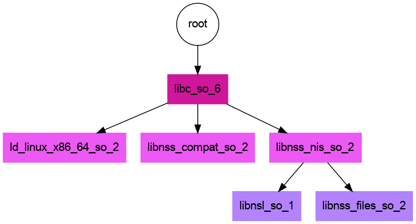

# LD_AUDIT Yaml


This is a small library to make it easy to run [LD_AUDIT](https://man7.org/linux/man-pages/man7/rtld-audit.7.html) to
get a "trace" of execution in terms of libraries sniffed and loaded. Why?
I want to eventually be able to trace everything that gets loaded at a particular call
for a container, so I wanted to test this out. After [build](#build) There are a few use cases:

 - [Terminal Output](#terminal-output): prints YAML to the terminal for easy inspection
 - [File Output](#file-output): the same YAML, but to an output file defined by an environment variable.
 - [Container](#docker): Build or run a container that provides the same functionality.
 - [Generate Graph](#generate-graph): A simple example of generating a graph from the YAML

## Build

```bash
$ make
```

## Test

### Terminal Output

```bash
$ make run
```

or more directly:

```bash
$ LD_AUDIT=./auditlib.so whoami
```

Since the shared library cannot have a destructor (I think it requires a main to
be called) I opted to print YAML output instead of json, since we cannot easily
mark the end and close a yaml data structure.

```bash
LD_AUDIT=./auditlib.so whoami
auditlib:
  la_version: 1
  audits:
  - event: handshake
    function: la_version
    value: 1
  - event: object_loaded
    name: ""
    function: la_objopen
    identifier: 0x7f2bc9bd6610
    flag: LM_ID_BASE
    description: Link map is part of the initial namespace
  - event: object_loaded
    name: "/lib64/ld-linux-x86-64.so.2"
    function: la_objopen
    identifier: 0x7f2bc9bd5e68
    flag: LM_ID_BASE
    description: Link map is part of the initial namespace
  - event: activity_occurring
    function: la_activity
    initiated_by: 0x7f2bc9bd6610
    flag: LA_ACT_ADD
    description: New objects are being added to the link map.
  - event: searching_for
    function: la_objsearch
    name: "libc.so.6"
    initiated_by: 0x7f2bc9bd6610
    flag: "LA_SER_ORIG"
  - event: searching_for
    function: la_objsearch
    name: "/lib/x86_64-linux-gnu/libc.so.6"
    initiated_by: 0x7f2bc9bd6610
    flag: "LA_SER_CONFIG"
  - event: object_loaded
    name: "/lib/x86_64-linux-gnu/libc.so.6"
    function: la_objopen
    identifier: 0x7f2bc96425b0
    flag: LM_ID_BASE
    description: Link map is part of the initial namespace
...
vanessasaur
```

Yu can see the full output in the file [ldaudit.yaml](ldaudit.yaml) (generation discussed next!)

### File Output

Since printing yaml to the terminal isn't always ideal, we can prepare an output file instead.

```bash
$ touch ldaudit.yaml
$ export LDAUDIT_OUTFILE=ldaudit.yaml
$ LD_AUDIT=./auditlib.so whoami
```

And then you won't see terminal output, but it will be in [ldaudit.yaml](ldaudit.yaml).

### Docker

To build a container to handle the build:

```bash
$ docker build -t auditlib .
```

And then run the same!

```bash
$ docker run -it  auditlib whoam
```

You can use this as a base container, and then have your application export `LDAUDIT_OUTFILE`
before running anything to get the contents to file, or more interactively:

```bash
$ docker run --env LDAUDIT_OUTFILE=/data/test.yaml -v $PWD/:/data -it auditlib whoami
root
$ cat test.yaml 
```

You can also use the [prebuilt container](https://github.com/buildsi/ldaudit-yaml/pkgs/container/ldaudit-yaml) instead:

```bash
$ docker run -it ghcr.io/buildsi/ldaudit-yaml:latest ls
```

## Generate Graph

The script [generate_dot.py](generate_dot.py) is a very rudimentary example of generating a diagram from the loads.

```
$ make dot
```

Will generate the following:


This isn't totally correct - continue reading to learn why!

### Verify Graph

I wanted to verify that the graph above was correct, so I decided to
first look at the ELF_NEEDED headers to follow the chain that we see above.
Checking our original executable whoami checks out - it needs libc.6.so:

```bash
$ readelf -d $(which whoami)| grep NEEDED
 0x0000000000000001 (NEEDED)             Shared library: [libc.so.6]
```

But then when I did the same for libc6.so, I was surprised to only see one entry:

```bash
$ readelf -d /lib/x86_64-linux-gnu/libc.so.6 | grep NEEDED
 0x0000000000000001 (NEEDED)             Shared library: [ld-linux-x86-64.so.2]
```

So I found two issues:

1. we have extra libraries loaded in our image (by libc.6.so)
2. we are missing the link between the x86 needed library shown above and libc.so.6.

### Extra Libraries?

For the first point, I did enough searching until I think I found an answer! 
it looks like libc.so.6 loads these libraries dynamically with dlopen ([see this thread](https://stackoverflow.com/questions/31106735/chgrp-and-linked-libraries)) so that part of the picture is correct. 


### Missing a Needed Symbol

But for the NEEDED - I was trying to make up reasons for why it might not be there -
could it be that we don't use whatever part of the library that needs it? Or perhaps once it's loaded there is no additional
output by Ld audit that we need to find it again? I wasn't satisifed with these
answers, so I wrote an additional function to parse symbols, or more specifically,
to tell us whenever there was a symbol bind between a library that needed it
and one that provided it. Once I did this, I could clearly see that libc.so.6 
(identifier `0x7f3a5afa9550`)

```yaml
  - event: object_loaded
    name: "/lib/x86_64-linux-gnu/libc.so.6"
    function: la_objopen
    identifier: 0x7f3a5afa9550
    flag: LM_ID_BASE
    description: Link map is part of the initial namespace
```

Was in fact loading symbols from ld-linux-x86-64.so.2 (identifier 0x7f3a5b545e68)

```yaml
  - event: object_loaded
    name: "/lib64/ld-linux-x86-64.so.2"
    function: la_objopen
    identifier: 0x7f3a5b545e68
    flag: LM_ID_BASE
    description: Link map is part of the initial namespace
```

We can see that here:

```yaml
  - event: symbol_bind
    name: "_dl_find_dso_for_object"
    function: la_symbind32
    where_needed: 0x7f3a5afa9550
    where_defined: 0x7f3a5b545e68
    index_symbol: 15
    description: Unknown
  - event: symbol_bind
    name: "__tunable_get_val"
    function: la_symbind32
    where_needed: 0x7f3a5afa9550
    where_defined: 0x7f3a5b545e68
    index_symbol: 21
    description: Unknown
```

So I updated my image generation tool to take these loads into consideration. Here is the final image!



To clarify the above - our call to `whoami` (root) directly needs libc.so.6. libc.so.6 loads symbols from  `/lib64/ld-linux-x86-64.so.2`,
but also dynamically loads the other two (*.nis and *compat) via a dlopen call. And finally, the leaves of the tree (the bottom
two node) are indeed needed by libnss_nis.so.2:

```bash
$ readelf -d /lib/x86_64-linux-gnu/libnss_nis.so.2 | grep NEEDED
 0x0000000000000001 (NEEDED)             Shared library: [libnsl.so.1]
 0x0000000000000001 (NEEDED)             Shared library: [libnss_files.so.2]
 0x0000000000000001 (NEEDED)             Shared library: [libc.so.6]
```
The interesting thing is that even though libc.6.so is needed here, we don't see it actually get searched for, nor
do we see symbols get bound. I'm not sure I have an answer for this one, but please [open an issue](https://github.com/buildsi/ldaudit-yaml) 
for discussion if you might!

### License

This project is part of Spack. Spack is distributed under the terms of both the MIT license and the Apache License (Version 2.0). Users may choose either license, at their option.

All new contributions must be made under both the MIT and Apache-2.0 licenses.

See LICENSE-MIT, LICENSE-APACHE, COPYRIGHT, and NOTICE for details.

SPDX-License-Identifier: (Apache-2.0 OR MIT)

LLNL-CODE-811652
